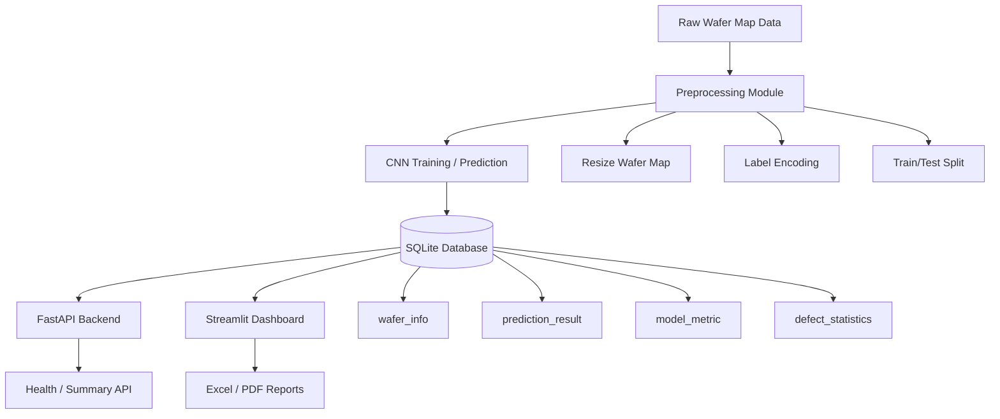
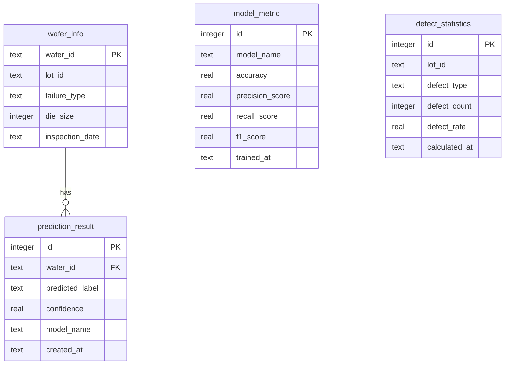

# Architecture

## Data Lifecycle

1. `src.data.load_data` loads `data/raw/wafer_map_dataset.pkl` or creates synthetic wafer map records.
2. `src.data.preprocess` normalizes wafer map size, saves `.npy` maps, writes train/test CSV files, and writes `label_map.json`.
3. `src.models.train` trains the CNN, evaluates the test set, stores metrics, and writes predictions to SQLite.
4. `src.api.main` exposes prediction, health, summary, metric, and statistics endpoints.
5. `src.dashboard.app` reads from SQLite and renders an operations dashboard.
6. `src.utils.report_generator` exports Excel/PDF reports.

## Operations Dashboard

The dashboard is organized around production-like monitoring views:

- Control Tower: KPI summary, risk lots, low-confidence predictions
- Lot Analytics: lot-level defect rate and defect distribution
- Wafer Review: wafer map inspection and prediction detail
- Model Ops: model metric, confidence distribution, confusion matrix, audit log
- Reports: Excel/PDF generation and executive snapshot

## ERD

